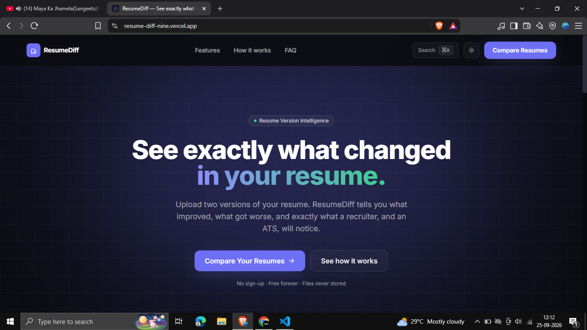
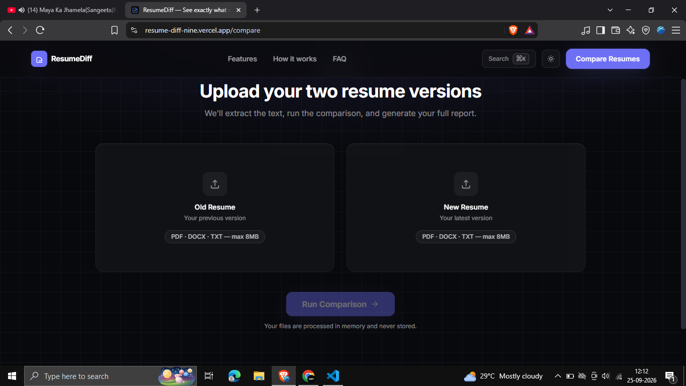

# ResumeDiff

ResumeDiff is a resume version intelligence tool that helps job seekers understand exactly what changed between two versions of their resume.

Instead of manually comparing documents line by line, ResumeDiff analyzes both versions and generates a detailed report showing improvements, missing keywords, ATS impact, readability changes, and skill differences.

---

## Problem

Most candidates continuously update their resumes but have no way to measure whether those changes actually improve their chances of getting interviews.

ResumeDiff solves this by providing a clear comparison between an old resume and a new resume.

---

## Features

* Compare two resume versions instantly
* ATS score comparison
* Added and removed skills detection
* Keyword intelligence and missing keyword analysis
* Readability comparison
* Section-by-section change tracking
* Resume improvement suggestions
* PDF, DOCX, and TXT support
* Fully responsive interface
* Privacy-first processing

---

## How It Works

### 1. Upload Two Resumes

Upload your old resume and your latest version.

### 2. Analysis Engine

ResumeDiff extracts text and analyzes:

* Skills
* Keywords
* Resume structure
* Readability
* ATS signals

### 3. Generate Report

Receive a detailed comparison showing:

* What improved
* What was removed
* ATS score changes
* Missing keywords
* Actionable recommendations

---

## Tech Stack

### Frontend

* React
* React Router
* Tailwind CSS
* Framer Motion
* Vite

### Backend

* Node.js
* Express.js

### Analysis

* Resume parsing
* Keyword extraction
* ATS scoring heuristics
* Text comparison engine

---

## Screenshots

### Landing Page



### Comparison Upload Page




## Installation

Clone the repository:

```bash
git clone https://github.com/manashwebdev/ResumeDiff.git
```

Install dependencies:

```bash
npm install
```

Start development server:

```bash
npm run dev
```

---

## Project Structure

```text
src
├── components
├── pages
├── lib
├── assets
├── styles
└── App.jsx
```

---

## Why ResumeDiff?

Resume builders help create resumes.

ResumeDiff helps improve them.

By focusing on version-to-version analysis, ResumeDiff provides visibility into what actually changed and whether those changes strengthen the resume.

---

## Future Improvements

* Job description matching
* Industry-specific ATS scoring
* Resume history tracking
* Exportable PDF reports
* AI-powered optimization suggestions

---

## Author

Manash Khati

GitHub: https://github.com/manashwebdev

---

## License

MIT License
