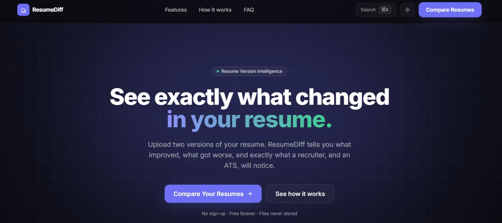
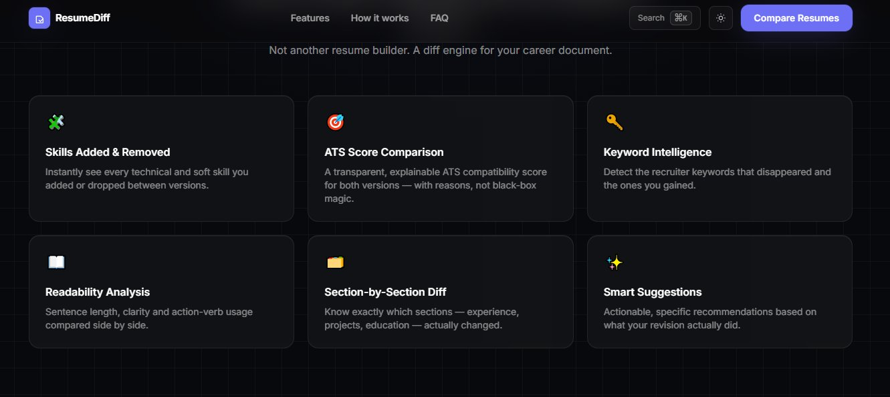
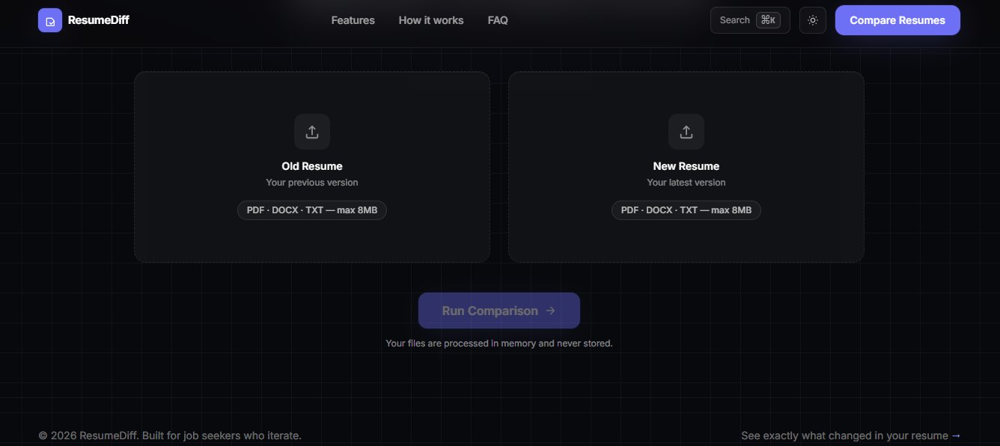
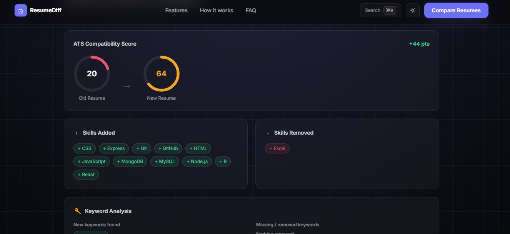

# ResumeDiff

Compare two versions of a resume and instantly identify added skills, removed skills, and ATS-related changes.

## Overview

ResumeDiff is a web application that helps job seekers track how their resumes evolve over time. Instead of manually comparing documents line by line, users can upload an old resume and a new resume to receive a detailed comparison report.

The application analyzes both resumes and highlights:

* Added skills
* Removed skills
* Common skills
* ATS-related differences
* Resume improvement insights

This makes it easier to optimize resumes before applying for jobs and understand exactly what has changed between versions.

## Features

* Upload two resume PDFs
* Automatic skill extraction
* Added skills detection
* Removed skills detection
* Shared skills analysis
* ATS-focused comparison
* Responsive user interface
* Fast comparison results

## Tech Stack

### Frontend

* React
* Vite
* Tailwind CSS

### Backend

* Node.js
* Express.js

### File Processing

* Multer
* PDF Parsing

## How It Works

1. Upload an old resume.
2. Upload a new resume.
3. The system extracts skills from both documents.
4. ResumeDiff compares the extracted data.
5. A detailed comparison report is generated.

## Screenshots

### Dashboard



### Features



### Upload Process



### Results



## Local Setup

### Clone Repository

```bash
git clone https://github.com/manashwebdev/ResumeDiff.git
cd ResumeDiff
```

### Backend Setup

```bash
cd backend
npm install
npm start
```

Server runs on:

```bash
http://localhost:5050
```

### Frontend Setup

```bash
cd frontend
npm install
npm run dev
```

Frontend runs on:

```bash
http://localhost:5173
```

## API Endpoint

### Compare Resumes

```http
POST /api/compare
```

Uploads:

* oldResume
* newResume

Returns:

* Added skills
* Removed skills
* Common skills
* Comparison summary

## Live Demo

Frontend:
https://resume-diff-azure.vercel.app

Backend:
https://resumediff-backend.onrender.com

## Future Improvements

* AI-powered resume suggestions
* Skill categorization
* Resume scoring
* Downloadable reports
* Multiple resume version tracking

## Author

**Manash Khati**

* GitHub: https://github.com/manashwebdev
* LinkedIn: Add your LinkedIn profile link
